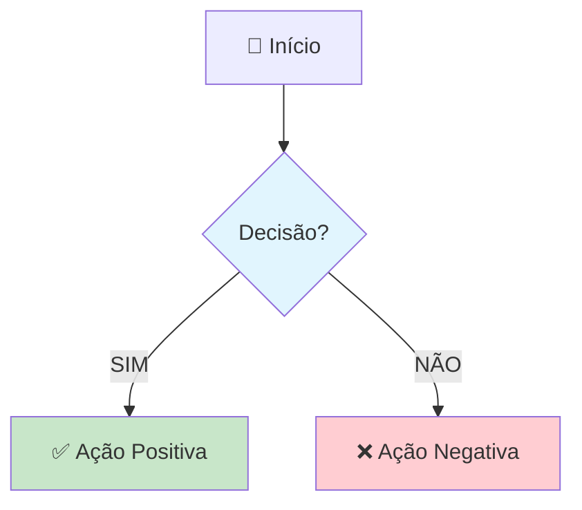
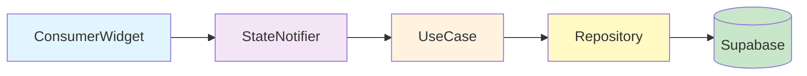
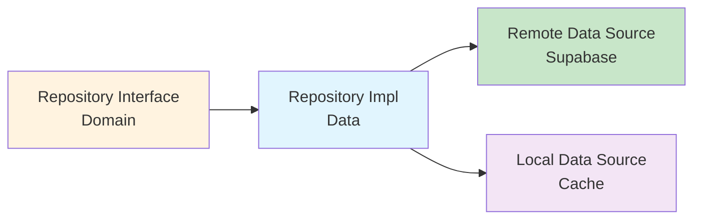
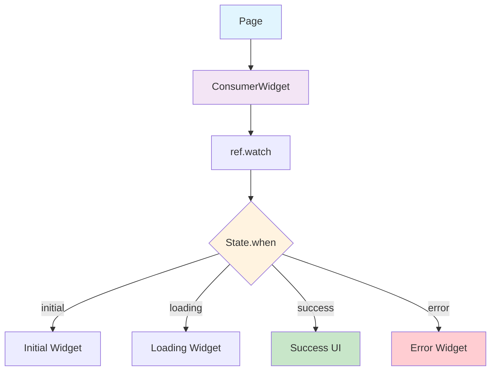

# 📚 Mnesis Flutter - Guia de Documentação

<div align="center">


</div>

Guia para estrutura, nomenclatura e formatação da documentação técnica e de usuário do **Volan Flutter** - Sistema de Autenticação Flutter com Clean Architecture + Riverpod + Supabase.

## 📋 **Índice**

1. [**📂 Estrutura de Pastas**](#-estrutura-de-pastas)
2. [**📝 Nomenclatura de Arquivos**](#-nomenclatura-de-arquivos)
3. [**📋 Seções de Documentação**](#-seções-de-documentação)
4. [**🎨 Formatação e Elementos Visuais**](#-formatação-e-elementos-visuais)
5. [**📄 Templates**](#-templates)
6. [**🎯 Guias Especializados**](#-guias-especializados)

---

## 📂 **Estrutura de Pastas**

### **🏗️ Organização Padrão**

```text
documentation/
├── technical/                               # 🔴 DOCUMENTAÇÃO TÉCNICA
│   ├── widgets/                            # Custom widgets
│   │   └── [feature]/
│   │       └── [WidgetName]_TECH.md
│   ├── notifiers/                          # Riverpod StateNotifiers
│   │   └── [feature]/
│   │       └── [NotifierName]_TECH.md
│   ├── repositories/                       # Data repositories
│   │   └── [feature]/
│   │       └── [RepositoryName]_TECH.md
│   ├── models/                             # Data models & entities
│   │   └── [feature]/
│   │       └── [ModelName]_TECH.md
│   ├── services/                           # Services (Supabase, etc)
│   │   └── [service]/
│   │       └── [ServiceName]_TECH.md
│   ├── use_cases/                          # Domain use cases
│   │   └── [feature]/
│   │       └── [UseCaseName]_TECH.md
│   ├── providers/                          # Dependency Injection
│   │   └── [module]/
│   │       └── [ProviderName]_TECH.md
│   └── pages/                              # App pages/screens
│       └── [feature]/
│           └── [PageName]_TECH.md
├── userGuide/                              # 🔵 GUIAS DO USUÁRIO
│   └── [feature]/
│       └── [PageName]_GUIDE.md
├── DOCUMENTATION_GUIDE.md                  # 📚 Este guia
├── DART_DOC_GUIDE.md                       # 📝 Padrões Dart docs
└── FLOWFORGE_WORKFLOW_QUICK.md             # 🔄 Processo de desenvolvimento
```

### **📁 Regras de Organização**

1. **Documentação seletiva**: Nem todo arquivo precisa de ambos os tipos (veja critérios abaixo)
2. **Pastas em snake_case**: `use_cases`, `blocs`, `repositories`
3. **Idioma inglês**: Nomes de pastas sempre em inglês
4. **Estrutura espelha código**: Organize documentação seguindo estrutura de `lib/features/`

### **📋 Critérios para Tipos de Documentação**

#### **✅ Quando criar APENAS _TECH.md:**
- **StateNotifiers** - lógica de estado usada apenas por desenvolvedores
- **Repositories/Data Sources** - camada de dados não visível ao usuário
- **Use Cases** - lógica de negócio de domínio
- **Services** - integrações Supabase, APIs externas
- **Models/Entities** - estruturas de dados
- **Providers** - configuração de injeção de dependências (get_it)
- **Extensions** - funções auxiliares para desenvolvedores
- **Utils** - utilitários de desenvolvimento

#### **✅ Quando criar _TECH.md + _GUIDE.md:**
- **Pages** - telas que usuários finais veem/interagem
- **Custom Widgets visuais** - componentes de UI customizados
- **Features completas** - funcionalidades visíveis na interface
- **Fluxos de navegação** - rotas e navegação de usuário
- **Formulários** - que usuários preenchem
- **Dialogs/BottomSheets** - modais de interação

#### **❌ Quando NÃO criar _GUIDE.md:**
- Se apenas desenvolvedores vão usar
- Se não há interação visual com usuário final
- Se suporte nunca vai precisar explicar
- Classes puramente técnicas (utils, extensions, providers)

---

## 📝 **Nomenclatura de Arquivos**

### **📄 Padrão de Nomes**

- **Documentação Técnica**: `[ComponentName]_TECH.md`
- **Guia do Usuário**: `[ComponentName]_GUIDE.md`

### **✅ Exemplos Corretos**

| **Localização** | **Arquivo** |
|-----------------|-------------|
| `technical/pages/auth/` | `LoginPage_TECH.md` |
| `userGuide/auth/` | `LoginPage_GUIDE.md` |
| `technical/notifiers/auth/` | `AuthNotifier_TECH.md` |
| `technical/repositories/auth/` | `AuthRepository_TECH.md` |
| `technical/use_cases/auth/` | `SignInUseCase_TECH.md` |
| `technical/widgets/auth/` | `CustomTextField_TECH.md` |
| `technical/models/auth/` | `UserModel_TECH.md` |

### **❌ Evitar**

- ~~`Login_Page_Documentation.md`~~
- ~~`README_auth.md`~~
- ~~`auth_bloc.md`~~
- ~~`sign-in-usecase-doc.md`~~

---

## 🎨 **Formatação e Elementos Visuais**

### **Ícones Padrão**

| Ícone | Significado |
|-------|-------------|
| 📋 | Visão Geral / Overview |
| 🔧 | Configuração / Settings |
| 📊 | Dados / Analytics |
| 🔗 | Links / Referências |
| ⚠️ | Avisos / Warnings |
| 💡 | Dicas / Tips |
| ❓ | FAQ / Ajuda |
| 🚀 | Performance |
| 🔒 | Segurança |
| 🎯 | Objetivos |
| 📱 | Mobile / Flutter |
| 🎨 | UI / Design |
| 🔄 | Lifecycle / Fluxo |
| 🧪 | Testes |
| 💾 | Database / Supabase |

### **🏷️ Sistema de Badges Coloridos (OBRIGATÓRIO)**

**📋 TODA documentação DEVE ter no topo (após o título):**

```html
<div align="center">


</div>
```

**🎨 Cores Padronizadas por Categoria Flutter:**

| Categoria | Cor Badge | Exemplo |
|-----------|-----------|---------|
| **PAGE** | `teal` | `` |
| **WIDGET** | `cyan` | `` |
| **NOTIFIER** | `indigo` | `` |
| **REPOSITORY** | `deeporange` | `` |
| **USECASE** | `purple` | `` |
| **MODEL** | `yellow` | `` |
| **SERVICE** | `red` | `` |
| **PROVIDER** | `brown` | `` |
| **FEATURE** | `green` | `` |
| **GUIA** | `orange` | `` |
| **ENTITY** | `lightblue` | `` |

### **Diagramas e Gráficos**

**✅ USE (Ordem de Preferência)**:
1. **Mermaid** para fluxogramas e diagramas complexos
2. ASCII art para diagramas simples
3. Tabelas para representar fluxos simples

**🎯 Mermaid - Padrões Recomendados**:


**Convenções Mermaid**:
- Use emojis para identificação visual (🎯, ✅, ❌, 💾, 📋, 📱, 🔄)
- Cores consistentes: Perguntas (azul `#e1f5fe`), Sucessos (verde `#c8e6c9`), Erros (vermelho `#ffcdd2`)
- Quebras de linha com `<br/>` para textos longos
- Prefira `flowchart TD` (Top Down) para fluxos verticais
- Use `graph LR` (Left to Right) para arquiteturas horizontais

---

## 📋 **Seções de Documentação**

### **🔴 Documentação Técnica (_TECH.md)**

**Seções essenciais:**

1. **📋 Visão Geral** - Propósito e contexto do componente
2. **🏗️ Arquitetura** - Clean Architecture layer (Data/Domain/Presentation)
3. **🔄 Fluxo de Dados** - Como dados fluem entre camadas
4. **⚙️ Funcionalidades Principais** - Features implementadas
5. **💾 Integração Supabase** - Auth, Database, Storage
6. **📦 Dependências** - Packages do pubspec.yaml utilizados
7. **🚨 Tratamento de Erros** - Cenários de erro e fallbacks
8. **🚀 Performance** - Otimizações e benchmarks
9. **🔧 Manutenção** - Pontos de atenção e TODOs
10. **🧪 Testes Implementados** - Cobertura e localização

### **🔵 Guia do Usuário (_GUIDE.md)**

**Características essenciais:**

1. **🗣️ Linguagem simples** - Evite jargões técnicos
2. **👣 Passo a passo** detalhado com screenshots (quando possível)
3. **📱 Contexto Mobile** - Gestos, navegação específica Flutter
4. **🛠️ Solução de problemas** comuns
5. **📑 Índice rápido** para navegação
6. **🖼️ Exemplos práticos** de uso

---

## 📄 **Templates**

### **📄 Template Documentação Técnica - StateNotifier**

```markdown
# [NotifierName] - Documentação Técnica

<div align="center">


</div>

## 📋 **Visão Geral**
**Propósito**: [Descrição da responsabilidade do StateNotifier]

**Localização**: `lib/features/[feature]/presentation/notifiers/[notifier_name].dart`

## 🏗️ **Arquitetura**
**Layer**: Presentation (Clean Architecture)

**Page associada**: `[PageName]`

**Use Cases utilizados**:
- `[UseCaseName]`: [Propósito]



## 🔄 **State (freezed)**

### States:
```dart
@freezed
class [NotifierName]State with _$[NotifierName]State {
  const factory [NotifierName]State.initial() = _Initial;
  const factory [NotifierName]State.loading() = _Loading;
  const factory [NotifierName]State.success([DataType] data) = _Success;
  const factory [NotifierName]State.error(String message) = _Error;
}
```

### Provider:
```dart
final [notifierName]Provider = StateNotifierProvider<[NotifierName], [NotifierName]State>(
  (ref) => getIt<[NotifierName]>(),
);
```

## ⚙️ **Funcionalidades Principais**
1. **[Feature 1]**: [Descrição]
2. **[Feature 2]**: [Descrição]

## 🚨 **Tratamento de Erros**
[Como erros são gerenciados e comunicados à UI usando state.when()]

## 🧪 **Testes Implementados**
### **Localização**: `test/features/[feature]/presentation/notifiers/`

**Cobertura**: [X]%

---
*📅 Criado em*: [DD MMM YY]
*📋 Versão*: 1.0
*👥 Responsável*: Equipe de Desenvolvimento Mnesis Flutter
*🏷️ Tags*: [flutter, riverpod, state-notifier, clean-architecture]
```

### **📄 Template Documentação Técnica - Repository**

```markdown
# [RepositoryName] - Documentação Técnica

<div align="center">


</div>

## 📋 **Visão Geral**
**Propósito**: [Descrição da responsabilidade do Repository]

**Localização**: `lib/features/[feature]/data/repositories/[repository_name]_impl.dart`

**Interface**: `lib/features/[feature]/domain/repositories/[repository_name].dart`

## 🏗️ **Arquitetura de Dados**
**Layer**: Data (Clean Architecture)

**Data Sources utilizadas**:
- **Remote**: [Supabase]
- **Local**: [Shared Preferences / Hive]



## ⚙️ **Operações**
1. **[Operation 1]**: [Método e descrição]
2. **[Operation 2]**: [Método e descrição]

## 💾 **Integração Supabase**
**Tables**:
- `[table_name]`: [Estrutura e propósito]

## 🚨 **Tratamento de Erros**
[Como erros são tratados usando Either<Failure, Success>]

## 🧪 **Testes Implementados**
### **Localização**: `test/features/[feature]/data/repositories/`

**Cobertura**: [X]%

---
*📅 Criado em*: [DD MMM YY]
*📋 Versão*: 1.0
*👥 Responsável*: Equipe de Desenvolvimento Mnesis Flutter
*🏷️ Tags*: [flutter, repository, data, supabase]
```

### **📄 Template Documentação Técnica - Use Case**

```markdown
# [UseCaseName] - Documentação Técnica

<div align="center">


</div>

## 📋 **Visão Geral**
**Propósito**: [Descrição da regra de negócio do Use Case]

**Localização**: `lib/features/[feature]/domain/use_cases/[use_case_name].dart`

## 🏗️ **Arquitetura**
**Layer**: Domain (Clean Architecture)

**Repository utilizado**: `[RepositoryName]`

## 🔄 **Fluxo de Execução**
1. [Passo 1]
2. [Passo 2]
3. [Passo 3]

## ⚙️ **Parâmetros**
```dart
class [UseCaseName]Params {
  final String param1;
  final int param2;
}
```

## 🔄 **Retorno**
```dart
Either<Failure, [SuccessType]>
```

## 🧪 **Testes Implementados**
### **Localização**: `test/features/[feature]/domain/use_cases/`

**Cobertura**: [X]%

---
*📅 Criado em*: [DD MMM YY]
*📋 Versão*: 1.0
*👥 Responsável*: Equipe de Desenvolvimento Mnesis Flutter
*🏷️ Tags*: [flutter, usecase, domain, clean-architecture]
```

### **📄 Template Documentação Técnica - Page**

```markdown
# [PageName] - Documentação Técnica

<div align="center">


</div>

## 📋 **Visão Geral**
**Propósito**: [Descrição do que a Page faz]

**Localização**: `lib/features/[feature]/presentation/pages/[page_name].dart`

## 🏗️ **Arquitetura**
**Layer**: Presentation (Clean Architecture)

**StateNotifier associado**: `[NotifierName]`



## 🎨 **Estrutura de UI**
**Principais Widgets**:
- `[widget_id]`: [Descrição e propósito]

## 🔄 **Fluxo de Dados**
[Descrever como dados são obtidos via ref.watch(), ref.read(), ref.listen()]

## ⚙️ **Funcionalidades Principais**
1. **[Feature 1]**: [Descrição]
2. **[Feature 2]**: [Descrição]

## 🚀 **Performance**
**Otimizações implementadas**:
- [Lista de otimizações]

## 🧪 **Testes Implementados**
### **Localização**: `test/features/[feature]/presentation/pages/`

**Cobertura**: [X]%

---
*📅 Criado em*: [DD MMM YY]
*📋 Versão*: 1.0
*👥 Responsável*: Equipe de Desenvolvimento Mnesis Flutter
*🏷️ Tags*: [flutter, page, ui, riverpod, state-notifier]
```

### **📖 Template Guia do Usuário**

```markdown
# [PageName] - Guia do Usuário

<div align="center">


</div>

## 📑 **Índice Rápido**
1. [Como usar](#como-usar)
2. [Navegação](#navegação)
3. [Solução de Problemas](#solução-de-problemas)

## 🎯 **Como Usar [PageName]**

### **Acesso**
Para acessar esta funcionalidade:
1. [Passo 1]
2. [Passo 2]
3. [Passo 3]

### **Funcionalidades Disponíveis**

#### **📋 [Feature 1]**
**Passo a passo:**
1. [Passo detalhado]
2. [Passo detalhado]
3. [Passo detalhado]

**Resultado esperado**: [O que o usuário deve ver/receber]

## 📱 **Gestos e Interações**
- **Toque simples**: [Ação]
- **Toque longo**: [Ação]
- **Deslizar**: [Ação]

## 🔍 **Navegação**
**Retornar**: [Como voltar para tela anterior]

## 🛠️ **Solução de Problemas**

#### **Problema**: [Problema comum 1]
**Sintoma**: [Como o usuário identifica]
**Solução**:
1. [Passo de solução]

### **❓ Dúvidas Frequentes**

**Q: [Pergunta comum]**
A: [Resposta clara]

---
*📅 Criado em*: [DD MMM YY]
*📋 Versão*: 1.0
*👥 Responsável*: Equipe de Desenvolvimento Mnesis Flutter
*🏷️ Tags*: [guia, usuário, flutter]
```

---

## 🎯 **Guias Especializados**

O sistema de documentação do Volan Flutter inclui guias especializados para diferentes aspectos do desenvolvimento:

### **📝 Documentação de Código (Dart Docs)**

**[DART_DOC_GUIDE.md](./DART_DOC_GUIDE.md)** - Guia completo de padrões Dart documentation

Este guia especializado define:
- Padrões de documentação inline para classes, funções e propriedades
- Templates específicos para componentes Flutter (Widget, BLoC, Repository, UseCase)
- Convenções de formatação e tags Dart docs
- Exemplos práticos para diferentes tipos de código
- Checklist de qualidade para documentação inline

**Quando usar:**
- Ao documentar classes e funções em arquivos `.dart`
- Para adicionar Dart docs em componentes Flutter
- Quando precisar de exemplos de documentação inline

**Relação com este guia:**
- DOCUMENTATION_GUIDE.md: Define ONDE e COMO organizar arquivos de documentação externa
- DART_DOC_GUIDE.md: Define COMO documentar o código DENTRO dos arquivos `.dart`

### **🔄 Fluxo de Desenvolvimento**

**[FLOWFORGE_WORKFLOW_QUICK.md](./FLOWFORGE_WORKFLOW_QUICK.md)** - Processo de desenvolvimento e Git workflow

Define o fluxo de trabalho para:
- Branching strategy
- Processo de code review
- Atualização de documentação junto com código
- CI/CD e deployment

---

*📅 Criado em*: 28 NOV 25\
*📋 Versão*: 1.0\
*👥 Responsável*: Equipe de Desenvolvimento Mnesis Flutter\
*🏷️ Tags*: [documentação, guia, flutter, dart, templates, nomenclatura, estrutura, mermaid, clean-architecture, riverpod]
