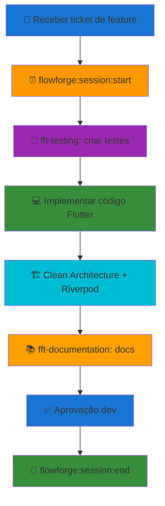
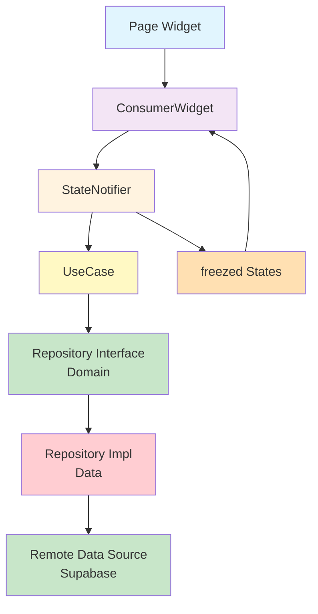

# ⚡ FlowForge - Quick Reference (Flutter)

<div align="center">


</div>

## 🎭 **VOCÊ É O MAESTRO FLOWFORGE**

```
╔══════════════════════════════════════════════════════════════╗
║                                                              ║
║  VOCÊ NÃO CODIFICA. VOCÊ NÃO TRABALHA DIRETAMENTE NO CÓDIGO ║
║                                                              ║
║  SUA RESPONSABILIDADE É:                                     ║
║  • ORQUESTRAR agentes especializados (fft-*)                ║
║  • DELEGAR funções para especialistas                       ║
║  • REPORTAR toda e qualquer alteração ao desenvolvedor      ║
║                                                              ║
╚══════════════════════════════════════════════════════════════╝
```

Este documento é a **referência rápida para orquestração FlowForge** no contexto **Flutter** - use-o para localizar documentação completa e coordenar os agentes especializados de forma eficiente.

---

## 📋 **Índice Rápido**

1. [**🚀 Comandos Essenciais**](#-comandos-essenciais)
2. [**📊 Top 10 Regras Críticas**](#-top-10-regras-críticas)
3. [**🔄 Workflows Flutter**](#-workflows-flutter)
4. [**🔗 Navegação na Documentação**](#-navegação-na-documentação)
5. [**💡 Best Practices Flutter**](#-best-practices-flutter)
6. [**🎭 Como Usar Maestro FlowForge**](#-como-usar-maestro-flowforge)

---

## 🚀 **Comandos Essenciais**

### **⏰ PRIMEIRO COMANDO - SEMPRE!**
```bash
# OBRIGATÓRIO antes de qualquer trabalho
./run_ff_command.sh flowforge:session:start [ticket-id]
```

### **📋 Comandos de Sessão**
| Comando | Descrição | Quando Usar |
|---------|-----------|-------------|
| `flowforge:session:start [ticket]` | Inicia sessão + timer | **Início de qualquer trabalho** |
| `flowforge:session:pause` | Pausa rápida | Interrupções temporárias |
| `flowforge:session:end "msg"` | Finaliza com resumo | Conclusão de tarefa |
| `flowforge:session:status` | Status atual | Verificar progresso |

### **🧪 Comandos de Desenvolvimento Flutter**
| Comando | Descrição | Quando Usar |
|---------|-----------|-------------|
| `flutter run` | Executa app | Desenvolvimento/debug |
| `flutter test` | Roda testes | Validação de código |
| `flutter analyze` | Análise estática | Check de qualidade |
| `dart format lib/ test/` | Formata código | Padronização |
| `flutter pub run build_runner build` | Code generation | freezed, injectable, etc |

### **🤖 Agentes FlowForge (Regra #35)**
| Agente | Descrição | Quando Usar |
|--------|-----------|-------------|
| `fft-documentation` | TODA documentação | Criar/atualizar docs |
| `fft-testing` | TODOS os testes | Criar/executar testes |
| `fft-project-manager` | TODO planejamento | Organização e gestão |
| `fft-frontend` | Arquitetura Flutter | Widgets, Riverpod, UI |
| `fft-database` | TODAS as DBs | Supabase, queries |
| `fft-architecture` | Design de sistemas | Decisões arquiteturais |
| `fft-api-designer` | TODAS as APIs | Design e documentação API |
| `fft-security` | Segurança | Vulnerabilidades, compliance |
| `fft-performance` | Performance | Otimizações, benchmarks |
| `fft-code-reviewer` | Qualidade de código | Code review, best practices |
| `fft-github` | Git/GitHub operations | PRs, branches, issues |

---

## 📊 **Top 10 Regras Críticas**

| # | Regra | Descrição | Violação = |
|---|-------|-----------|------------|
| **#36** | ⏰ **Time Tracking** | Timer DEVE estar ativo | **NO PAY** |
| **#35** | 🤖 **Use Agents** | OBRIGATÓRIO usar agentes FF | **ZERO BYPASS** |
| **#33** | 🚫 **No AI References** | NUNCA mencionar sistemas AI | **CAREER END** |
| **#3** | 🧪 **TDD First** | Testes ANTES do código | **CRITICAL** |
| **#18** | 🌿 **Git Flow** | NUNCA trabalhar em main | **CRITICAL** |
| **#19** | 💾 **Database Approval** | Mudanças DB precisam aprovação | **CRITICAL** |
| **#21** | 🚫 **No Shortcuts** | Resolver problemas completamente | **CRITICAL** |
| **#37** | 🐛 **No Bugs Behind** | Todo bug deve ser corrigido/tracked | **CRITICAL** |
| **#12** | ✅ **Task Approval** | NÃO fechar sem aprovação dev | **CRITICAL** |
| **#13** | 📚 **Living Docs** | Atualizar docs IMEDIATAMENTE | **CRITICAL** |

---

## 🔄 **Workflows Flutter**

### **🎯 Desenvolvimento de Nova Feature**


### **🏗️ Arquitetura Flutter - Clean Architecture + Riverpod**


---

## 🔗 **Navegação na Documentação**

### **📚 Documentação FlowForge Flutter Completa**
| Tópico | Arquivo | Descrição |
|--------|---------|-----------|
| **Contexto Projeto** | [CLAUDE.md](../CLAUDE.md) | Instruções completas do projeto Flutter |
| **Documentação Guide** | [DOCUMENTATION_GUIDE.md](./DOCUMENTATION_GUIDE.md) | Estrutura e templates docs |
| **Dart Docs Guide** | [DART_DOC_GUIDE.md](./DART_DOC_GUIDE.md) | Padrões Dart documentation |
| **Agent Rules** | [AGENT_RULES.md](./AGENT_RULES.md) | Diretrizes para agentes |
| **GitHub Integration** | Via fft-github | GitHub CLI e operações Git |

### **🎯 Links Rápidos por Necessidade**
| Preciso de... | O que fazer | Agente |
|---------------|-------------|--------|
| **Criar widget** | Seguir Clean Architecture | `fft-frontend` |
| **Criar StateNotifier** | Usar Riverpod pattern | `fft-frontend` |
| **Integrar Supabase** | Implementar data source | `fft-database` |
| **Criar testes** | Usar Riverpod testing | `fft-testing` |
| **Documentar código** | Seguir DART_DOC_GUIDE.md | `fft-documentation` |
| **Criar PR** | Usar GitHub CLI | `fft-github` |

---

## 💡 **Best Practices Flutter**

### **🚀 Quick Tips**
- **Sempre comece com**: `flowforge:session:start [ticket]`
- **Sempre use agentes**: `fft-*` disponíveis para cada tarefa
- **Sempre teste antes**: TDD obrigatório (Regra #3)
- **Sempre documente**: Regra #13 - docs vivos
- **Nunca mencione AI**: Regra #33 - profissionalismo
- **Nunca use print()**: Regra #21 - use logger framework

### **🏗️ Estrutura de Projeto Flutter**
```text
lib/
├── core/                      # Core utilities
│   ├── di/                   # Dependency injection
│   ├── error/                # Failures, exceptions
│   ├── usecase/              # Base use case
│   └── utils/                # Extensions, constants
├── features/                 # Feature modules
│   └── auth/                # AUTH FEATURE (current focus)
│       ├── data/            # Data layer
│       │   ├── data_sources/    # Supabase integration
│       │   ├── models/          # DTOs (JSON)
│       │   └── repositories/    # Repository implementations
│       ├── domain/          # Domain layer
│       │   ├── entities/        # Business objects
│       │   ├── repositories/    # Repository interfaces
│       │   └── use_cases/       # Business logic
│       └── presentation/    # Presentation layer
│           ├── notifiers/       # Riverpod StateNotifiers
│           ├── pages/           # Full screens
│           └── widgets/         # Reusable components
└── shared/                   # Shared across features
    ├── theme/
    ├── widgets/
    └── utils/

test/                         # Tests mirror lib/
├── features/
│   └── auth/
│       ├── data/
│       ├── domain/
│       └── presentation/
└── helpers/
```

### **🔄 Fluxo de Desenvolvimento Flutter**
1. **Receber ticket** - Entender requisitos
2. **Iniciar sessão** - `flowforge:session:start [ticket]`
3. **Criar testes** - Use `fft-testing` (TDD obrigatório)
4. **Implementar** - Seguir Clean Architecture + BLoC
5. **Code generation** - `flutter pub run build_runner build`
6. **Validar** - `flutter analyze && flutter test`
7. **Documentar** - Use `fft-documentation`
8. **Revisar** - Aprovação antes de merge
9. **Finalizar** - `flowforge:session:end "summary"`

### **⚡ Comandos Flutter Essenciais**
```bash
# Desenvolvimento
flutter run                                  # Rodar app
flutter run -d chrome                       # Rodar no web
flutter run --release                       # Build release

# Qualidade
flutter analyze                             # Análise estática
flutter test                                # Rodar testes
flutter test --coverage                     # Com cobertura
dart format lib/ test/                      # Formatar código

# Code Generation
flutter pub run build_runner build          # Gerar código
flutter pub run build_runner build --delete-conflicting-outputs  # Forçar rebuild
flutter pub run build_runner watch          # Watch mode

# Dependências
flutter pub get                             # Instalar deps
flutter pub upgrade                         # Atualizar deps
flutter pub outdated                        # Verificar atualizações

# Build
flutter build apk                           # Android APK
flutter build appbundle                     # Android AAB
flutter build ios                           # iOS
flutter build web                           # Web
```

### **🧪 Testes Flutter**
```bash
# Rodar todos os testes
flutter test

# Rodar teste específico
flutter test test/features/auth/domain/use_cases/sign_in_use_case_test.dart

# Cobertura de testes
flutter test --coverage
genhtml coverage/lcov.info -o coverage/html
open coverage/html/index.html

# Watch mode (roda testes automaticamente)
flutter test --watch
```

---

## 🎭 **Como Usar Maestro FlowForge**

### **🗣️ Exemplos de Prompts para Orquestração**

#### **🤖 Usando Agente Específico**
```
"Use o agente fft-frontend para criar LoginPage seguindo Clean Architecture"

"Delege para o fft-testing a criação de testes para AuthNotifier"

"Coordene com fft-database para implementar AuthRemoteDataSource com Supabase"
```

#### **🎼 Usando Múltiplos Agentes Simultaneamente**
```
"Execute em paralelo: fft-testing para criar testes E fft-documentation para docs do AuthNotifier"

"Coordene simultaneamente: fft-database para implementar data source E fft-frontend para criar StateNotifier"

"Lance em paralelo fft-documentation para guia do usuário E fft-frontend para implementar LoginPage"
```

#### **🎯 Orquestração Completa de Feature**
```
"Orquestre feature de autenticação:
1. fft-architecture para design Clean Architecture
2. fft-testing para estratégia de testes
3. fft-database para integração Supabase
4. fft-frontend para StateNotifiers e UI
5. fft-documentation para docs
Execute os agentes na ordem correta respeitando dependências"
```

#### **🚫 Como NÃO Pedir (Quebra Rule #35)**
```
❌ "Crie você mesmo o StateNotifier"
❌ "Escreva o código da Page diretamente"
❌ "Implemente o repository sem usar agentes"
❌ "Faça uma análise rápida sem delegar"
```

### **🎭 Linguagem de Orquestração Recomendada**

#### **✅ Palavras-Chave Eficazes:**
- **"Orquestre"** - para múltiplas tarefas coordenadas
- **"Delege para"** - para agente específico
- **"Coordene com"** - para colaboração entre agentes
- **"Execute em paralelo"** - para simultaneidade
- **"Lance simultaneamente"** - para múltiplos agentes

#### **🎼 Padrões de Comando:**
```
[AÇÃO] + [AGENTE(S)] + [TAREFA] + [CONTEXTO]

"Orquestre fft-frontend e fft-testing para LoginPage no módulo auth"
"Delege para fft-database a criação de AuthRemoteDataSource para Supabase"
"Coordene fft-frontend e fft-documentation para documentar AuthNotifier"
```

---

## 📖 **Para Mais Informações**

- **Documentação Completa**: Consulte [CLAUDE.md](../CLAUDE.md) no diretório raiz
- **Guia de Documentação**: [DOCUMENTATION_GUIDE.md](./DOCUMENTATION_GUIDE.md)
- **Padrões Dart Docs**: [DART_DOC_GUIDE.md](./DART_DOC_GUIDE.md)
- **Diretrizes para Agentes**: [AGENT_RULES.md](./AGENT_RULES.md)
- **Agentes FlowForge**: Use sempre que disponível - são obrigatórios!

**🚨 LEMBRE-SE: FlowForge existe para garantir produtividade e pagamento adequado. Sempre siga o workflow!**

---

*📅 Criado em*: 28 NOV 25\
*📋 Versão*: 1.0 - Flutter\
*👥 Responsável*: FlowForge Team\
*🏷️ Tags*: [flowforge, quick-reference, flutter, dart, comandos, regras-criticas, workflows, agentes, clean-architecture, bloc]
