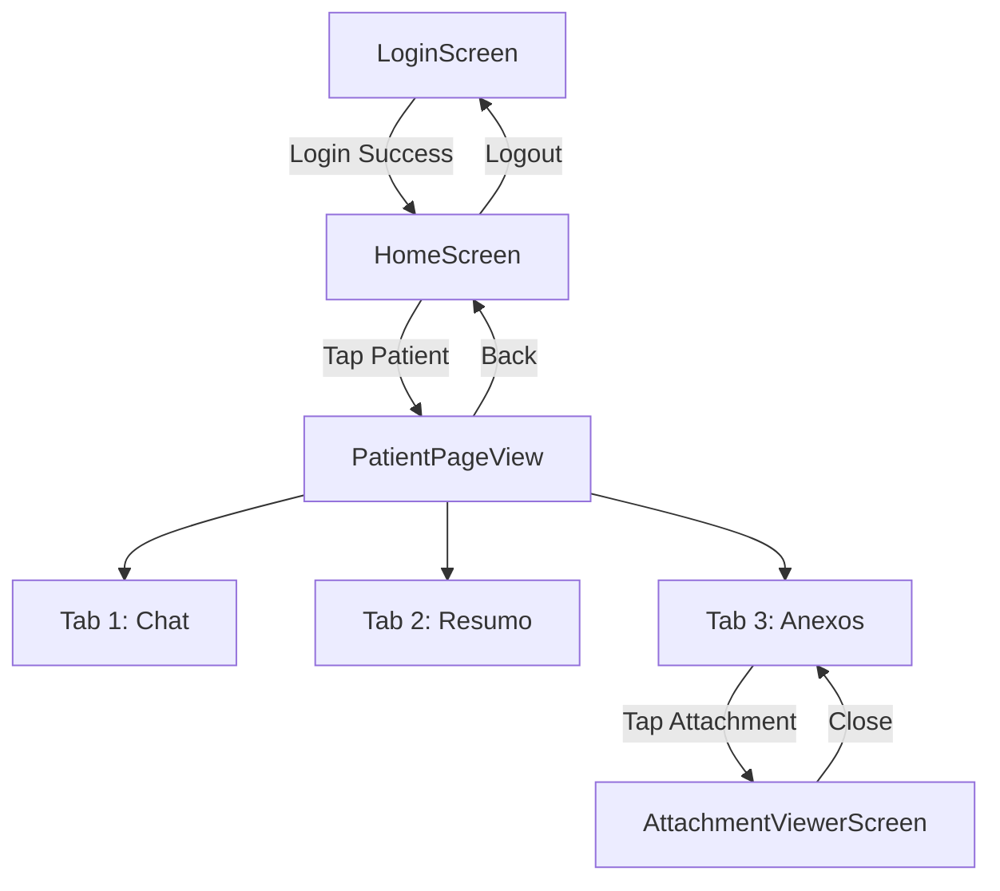

# Mnesis MVP Architecture

**Status**: ✅ Active (MVP Scope)
**Version**: 3.0.0 (MVP Revision)
**Last Updated**: 2026-01-23
**Approach**: Option Charlie (Hybrid Preservation)

---

## 📋 Table of Contents

1. [Architecture Overview](#architecture-overview)
2. [MVP Scope (5+1 Screens)](#mvp-scope-5-1-screens)
3. [Navigation Flow](#navigation-flow)
4. [State Management Strategy](#state-management-strategy)
5. [Mock Data Strategy](#mock-data-strategy)
6. [Preserved Infrastructure](#preserved-infrastructure)
7. [Removed Features](#removed-features)
8. [Future Roadmap (v1)](#future-roadmap-v1)

---

## Architecture Overview

### Core Philosophy

**MVP Approach: Hybrid Preservation (Option Charlie)**
- **Preserve**: Grade A design system (94/100), 1,165 passing tests, DI infrastructure
- **Remove**: Chat Secretaria, Agenda, appointments_cache, horizontal navigation
- **Add**: 5+1 MVP screens with mock data
- **Timeline**: 2 weeks (45-60 hours)

### Technology Stack

**Frontend**:
- **Framework**: Flutter 3.35.5
- **State Management**: Riverpod (preserved from previous work)
- **Navigation**: go_router (simplified routes)
- **Design System**: Custom Mnesis Material 3 theme (Grade A)
- **Testing**: flutter_test + mocktail (80%+ coverage)

**Backend (Deferred to v1)**:
- **Mock Data**: Hardcoded JSON for patients, attachments, chat responses
- **Real Integration**: Post-MVP (Supabase + LLM backend)

**Authentication**:
- **Provider**: Supabase Auth
- **UI**: Placeholder (awaiting final design)
- **Storage**: flutter_secure_storage (session token)

**Local Storage**:
- **Database**: SQLite (drift) - minimal usage
- **Tables**: conversations, messages (chat cache only)
- **Removed**: appointments_cache table

---

## MVP Scope (5+1 Screens)

### Screen 1: Login (PENDING DESIGN)

**Status**: Placeholder implementation
**Authentication**: Supabase email/password
**Design**: Using existing Mnesis components (MnesisInput, MnesisButton)

**Components**:
```
LoginScreen
├── Logo (placeholder icon)
├── MnesisInput (email)
├── MnesisInput (password)
├── MnesisButton.primary (login)
└── Error message display
```

**Navigation**: Login → Home (on success)

---

### Screen 2: Home (HomeScreen.png)

**Features**:
- Patient list (mock data: 10-15 patients)
- Search functionality (filter by name)
- Stats cards (total, active, pending)
- Navigation to Chat per patient

**Components**:
```
HomeScreen
├── AppBar (title + logout button)
├── MnesisInput (search bar)
├── Stats cards (horizontal scroll)
│   ├── Total patients
│   ├── Active patients
│   └── Pending patients
└── Patient list (ListView)
    └── PatientCard (name, diagnosis, last visit)
```

**State**: `filteredPatientsProvider(searchQuery)`
**Data Source**: `MockPatients.patients`
**Navigation**: Tap patient → `/patient/:patientId`

---

### Screen 3: Chat Assistente (ChatAssistentScreen.png)

**Features**:
- AI chat interface per patient
- Message history (user + AI bubbles)
- Mock streaming responses (simulated with delay)
- Voice input button (placeholder)
- Suggestion chips

**Components**:
```
ChatAssistenteScreen (PageView screen #1)
├── Message list (ListView.builder)
│   ├── AI message bubbles (left-aligned, dark gray)
│   └── User message bubbles (right-aligned, transparent)
├── Input area
│   ├── MnesisInput (message text)
│   ├── Send button
│   └── Voice button (placeholder)
└── Suggestion chips (quick actions)
```

**State**: `chatNotifierProvider(patientId)`
**Data Source**: `MockChatDataSource` (context-aware responses)
**Streaming**: Simulated with `Stream.periodic` (50ms chunks)

---

### Screen 4: Resumo Paciente (PatientSummaryScreen.png)

**Features**:
- Patient demographic info (name, age, gender)
- Medical history summary
- Quick stats (last visit, diagnosis)
- Tab integration (PageView screen #2)

**Components**:
```
ResumoPatienteScreen (PageView screen #2)
├── Patient header (avatar + name + age)
├── Info cards
│   ├── Personal info (email, phone, address)
│   ├── Medical history (diagnosis, conditions)
│   └── Last visit (date, notes)
└── Stats section (appointments, attachments)
```

**State**: `patientProvider(patientId)`
**Data Source**: `MockPatients.getById(patientId)`

---

### Screen 5: Anexos (AttachsScreen.png)

**Features**:
- Attachment list (PDFs, images)
- File metadata (name, size, date)
- Tap to open viewer

**Components**:
```
AnexosScreen (PageView screen #3)
└── Attachment list (ListView)
    └── AttachmentCard
        ├── Icon (PDF/image)
        ├── File name
        ├── File size + date
        └── Tap → AttachmentViewerScreen
```

**State**: `attachmentsProvider(patientId)`
**Data Source**: `MockAttachments.getByPatientId(patientId)`
**Navigation**: Tap → `/attachment/:attachmentId`

---

### Screen 6: Visualização Anexo (AttachVisualizationScreen.png)

**Features**:
- PDF viewer (flutter_pdfview)
- Image viewer (pinch to zoom)
- Close button

**Components**:
```
AttachmentViewerScreen
├── AppBar (file name + close button)
└── Viewer (PDF or Image)
    ├── PDFView (for .pdf files)
    └── InteractiveViewer (for images)
```

**State**: `attachmentProvider(attachmentId)`
**Data Source**: Asset files (`assets/sample_exam.pdf`, `assets/sample_xray.png`)

---

## Navigation Flow

### Simplified Navigation (Login → Home → PageView)



### go_router Configuration

```dart
final appRouter = GoRouter(
  initialLocation: '/',
  redirect: (context, state) {
    // Auth guard
    final authState = context.read(authNotifierProvider);
    final isLoggedIn = authState.maybeWhen(
      authenticated: (_) => true,
      orElse: () => false,
    );

    final isGoingToLogin = state.location == '/';

    if (!isLoggedIn && !isGoingToLogin) {
      return '/';
    }
    if (isLoggedIn && isGoingToLogin) {
      return '/home';
    }
    return null;
  },
  routes: [
    GoRoute(
      path: '/',
      name: 'login',
      builder: (context, state) => const LoginScreen(),
    ),
    GoRoute(
      path: '/home',
      name: 'home',
      builder: (context, state) => const HomeScreen(),
    ),
    GoRoute(
      path: '/patient/:patientId',
      name: 'patient',
      builder: (context, state) {
        final patientId = state.pathParameters['patientId']!;
        return PatientPageView(patientId: patientId);
      },
    ),
    GoRoute(
      path: '/attachment/:attachmentId',
      name: 'attachment',
      builder: (context, state) {
        final attachmentId = state.pathParameters['attachmentId']!;
        return AttachmentViewerScreen(attachmentId: attachmentId);
      },
    ),
  ],
);
```

### PageView Implementation (Chat ↔ Resumo ↔ Anexos)

```dart
class PatientPageView extends ConsumerStatefulWidget {
  final String patientId;

  @override
  Widget build(BuildContext context) {
    return Scaffold(
      appBar: AppBar(
        title: Text(patient.name),
        bottom: TabBar(
          controller: _tabController,
          tabs: const [
            Tab(text: 'Chat'),
            Tab(text: 'Resumo'),
            Tab(text: 'Anexos'),
          ],
        ),
      ),
      body: PageView(
        controller: _pageController,
        onPageChanged: (index) {
          _tabController.animateTo(index);
        },
        children: [
          ChatAssistenteScreen(patientId: patientId),
          ResumoPatienteScreen(patientId: patientId),
          AnexosScreen(patientId: patientId),
        ],
      ),
    );
  }
}
```

**Navigation Features**:
- ✅ Swipe gestures between tabs
- ✅ TabBar sync with PageView
- ✅ AppBar shows patient name
- ✅ Back button returns to Home

---

## State Management Strategy

### Riverpod Architecture (Preserved)

**Why Riverpod?**
- ✅ Type-safe providers
- ✅ Excellent testability
- ✅ Compile-time safety
- ✅ DevTools support

### Provider Types Used

#### 1. Provider (Immutable Data)
```dart
// Mock patient data
final patientsProvider = Provider<List<Patient>>((ref) {
  return MockPatients.patients;
});
```

#### 2. FutureProvider (Async Data)
```dart
// Simulated async data fetch
final patientProvider = FutureProvider.family<Patient, String>((ref, id) async {
  await Future.delayed(Duration(milliseconds: 300)); // Simulate network
  return MockPatients.getById(id);
});
```

#### 3. StateNotifierProvider (Mutable State)
```dart
// Chat state with streaming
final chatNotifierProvider = StateNotifierProvider.family<ChatNotifier, ChatState, String>(
  (ref, patientId) => ChatNotifier(
    patientId: patientId,
    chatDataSource: ref.watch(chatDataSourceProvider),
  ),
);
```

#### 4. StreamProvider (Streaming Data)
```dart
// Mock chat streaming
final chatStreamProvider = StreamProvider.autoDispose.family<String, String>(
  (ref, message) async* {
    final dataSource = ref.watch(chatDataSourceProvider);
    final stream = await dataSource.streamChatResponse(message: message);
    yield* stream;
  },
);
```

### State Management Example: Chat

```dart
// Chat state
@freezed
class ChatState with _$ChatState {
  const factory ChatState.initial() = _Initial;
  const factory ChatState.loading() = _Loading;
  const factory ChatState.loaded(List<Message> messages) = _Loaded;
  const factory ChatState.streaming({
    required List<Message> messages,
    required String currentChunk,
  }) = _Streaming;
  const factory ChatState.error(String message) = _Error;
}

// Chat notifier
class ChatNotifier extends StateNotifier<ChatState> {
  final String patientId;
  final ChatRemoteDataSource chatDataSource;

  ChatNotifier({
    required this.patientId,
    required this.chatDataSource,
  }) : super(const ChatState.initial());

  Future<void> sendMessage(String text) async {
    // Optimistically add user message
    final userMessage = Message(
      id: 'temp-${DateTime.now().millisecondsSinceEpoch}',
      text: text,
      isUser: true,
      timestamp: DateTime.now(),
    );

    state = ChatState.loaded([...currentMessages, userMessage]);

    // Stream AI response
    final stream = await chatDataSource.streamChatResponse(message: text);
    String fullResponse = '';

    await for (final chunk in stream) {
      fullResponse += chunk;
      state = ChatState.streaming(
        messages: [...currentMessages, userMessage],
        currentChunk: fullResponse,
      );
    }

    // Add complete AI message
    final aiMessage = Message(
      id: 'ai-${DateTime.now().millisecondsSinceEpoch}',
      text: fullResponse,
      isUser: false,
      timestamp: DateTime.now(),
    );

    state = ChatState.loaded([...currentMessages, userMessage, aiMessage]);
  }
}
```

---

## Mock Data Strategy

### Why Mock Data?

1. **Backend Not Ready**: API contracts not finalized
2. **Parallel Development**: Frontend progress independent of backend
3. **Demo Capability**: Functional app for stakeholder reviews
4. **Testing**: Deterministic data for widget tests

### Mock Data Providers

#### 1. Mock Patients
**Location**: `lib/shared/data/mock_patients.dart`

```dart
class MockPatients {
  static final List<Patient> patients = [
    Patient(
      id: '1',
      name: 'João Silva',
      age: 45,
      gender: 'M',
      diagnosis: 'Hipertensão',
      lastVisit: DateTime(2026, 1, 15),
      status: PatientStatus.active,
    ),
    // ... 10-15 patients
  ];

  static Patient getById(String id) => patients.firstWhere((p) => p.id == id);
  static List<Patient> search(String query) => patients.where((p) =>
    p.name.toLowerCase().contains(query.toLowerCase())
  ).toList();
}
```

#### 2. Mock Chat Responses
**Location**: `lib/features/chat/data/datasources/mock_chat_datasource.dart`

```dart
class MockChatDataSource implements ChatRemoteDataSource {
  @override
  Future<Stream<String>> streamChatResponse({
    required String message,
    String? conversationId,
  }) async {
    final response = _generateResponse(message);

    // Simulate streaming with 50ms delay per chunk
    return Stream.periodic(
      const Duration(milliseconds: 50),
      (index) => index < response.length ? response[index] : null,
    ).takeWhile((chunk) => chunk != null).cast<String>();
  }

  String _generateResponse(String userMessage) {
    final msg = userMessage.toLowerCase();

    if (msg.contains('exame')) {
      return 'Os exames do paciente indicam níveis normais...';
    }
    if (msg.contains('medicação')) {
      return 'A medicação atual inclui Losartana 50mg...';
    }
    return 'Entendi. Posso ajudar com mais informações.';
  }
}
```

#### 3. Mock Attachments
**Location**: `lib/shared/data/mock_attachments.dart`

```dart
class MockAttachments {
  static final List<Attachment> attachments = [
    Attachment(
      id: '1',
      name: 'Exame de Sangue - 15/01/2026.pdf',
      type: AttachmentType.pdf,
      size: 1024 * 250,
      date: DateTime(2026, 1, 15),
      assetPath: 'assets/sample_exam.pdf',
    ),
    // ... 5-10 attachments
  ];
}
```

### Transition to Real Backend (v1)

**Phase 1 (MVP)**: Mock providers
**Phase 2 (v1)**: Feature flag toggle
**Phase 3 (Production)**: Replace with real API

```dart
// Environment-based switching
final chatDataSourceProvider = Provider<ChatRemoteDataSource>((ref) {
  if (EnvConfig.useMockData) {
    return MockChatDataSource();
  }
  return ChatRemoteDataSourceImpl(
    httpClient: ref.watch(httpClientProvider),
  );
});
```

---

## Preserved Infrastructure

### What We're Keeping (Grade A Quality)

#### 1. Design System (94/100 Score)
**Location**: `lib/core/design_system/`

**Components**:
- `MnesisColors` - Color palette (primary orange, dark backgrounds)
- `MnesisTextStyles` - Typography (Inter font, 8 semantic styles)
- `MnesisSpacings` - Spacing system (4px base unit)
- `MnesisTheme` - Material 3 theme configuration (22+ component themes)

**Why Preserve**: Professionally designed, 138 accessibility tests, WCAG AA/AAA compliant

#### 2. Test Infrastructure (1,165 Passing Tests)
**Coverage**: 80%+

**Test Types**:
- Unit tests (data models, providers)
- Widget tests (screens, components)
- Accessibility tests (contrast ratios, touch targets)
- Integration tests (navigation flows)

**Why Preserve**: Quality assurance foundation, regression prevention

#### 3. Dependency Injection (get_it + injectable)
**Location**: `lib/core/di/`

**Setup**:
```dart
@InjectableInit()
void configureDependencies() => getIt.init();

void main() {
  configureDependencies();
  runApp(MyApp());
}
```

**Why Preserve**: Proven architecture, testability, scalability

#### 4. Environment Configuration
**Location**: `lib/core/config/`

```dart
class EnvConfig {
  static String get supabaseUrl => _env['SUPABASE_URL']!;
  static String get supabaseAnonKey => _env['SUPABASE_ANON_KEY']!;
  static bool get useMockData => _env['USE_MOCK_DATA'] == 'true';
}
```

**Why Preserve**: Production-ready, secure, environment-agnostic

#### 5. SQLite Foundation (drift)
**Location**: `lib/core/database/`

**Tables** (Minimal):
- `conversations` - Chat conversation metadata
- `messages` - Chat message cache

**Why Preserve**: Reusable infrastructure, proven setup

---

## Removed Features

### What We're Removing (MVP Scope Reduction)

#### 1. Chat Secretaria (Doctor ↔ Secretary P2P Chat)
**Reason**: Not essential for MVP, requires real-time backend
**Code Location**: `lib/features/chat_secretaria/`
**Effort to Remove**: 3 hours
**v1 Restoration**: 20 hours

#### 2. Agenda (Calendar View)
**Reason**: Complex UX, backend dependencies
**Code Location**: `lib/features/agenda/`, `lib/shared/widgets/calendar/`
**Dependencies Removed**: `table_calendar` (if present)
**Effort to Remove**: 2 hours
**v1 Restoration**: 15 hours

#### 3. appointments_cache Table
**Reason**: Deferred appointments to v1
**Schema Change**: Remove from `app_database.dart`
**Effort to Remove**: 1 hour
**v1 Restoration**: 4 hours

#### 4. Horizontal Scroll Navigation
**Reason**: Simplified navigation (Login → Home → PageView)
**Code Location**: Home screen navigation widgets
**Effort to Remove**: Included in refactoring (2h)

**Total Removal Effort**: 8 hours
**Total Restoration Effort (if needed in v1)**: 39 hours

---

## Future Roadmap (v1)

### Post-MVP Integration Tasks

#### 1. Backend Integration (30 hours)
**Tasks**:
- Replace mock providers with real API clients
- Implement SSE streaming for chat
- Supabase integration (patients, attachments)
- Error handling for network failures

**Providers to Replace**:
```dart
// Before (MVP)
final chatDataSourceProvider = Provider<ChatRemoteDataSource>((ref) {
  return MockChatDataSource();
});

// After (v1)
final chatDataSourceProvider = Provider<ChatRemoteDataSource>((ref) {
  return ChatRemoteDataSourceImpl(
    httpClient: ref.watch(httpClientProvider),
    baseUrl: EnvConfig.apiBaseUrl,
  );
});
```

#### 2. Final Auth Design (2-3 hours)
**Tasks**:
- Replace placeholder login UI
- Keep authentication logic intact
- Update branding/assets

#### 3. Restore Removed Features (if needed)
**Optional Tasks**:
- Chat Secretaria (20h)
- Agenda (15h)
- appointments_cache (4h)

**Total**: 39 hours

#### 4. Production Readiness (15 hours)
**Tasks**:
- Performance optimization
- Security audit
- App store submission
- Monitoring/analytics

---

## Architecture Diagrams

### Clean Architecture (3-Tier)

```
┌─────────────────────────────────────────────────────────────┐
│                    PRESENTATION LAYER                       │
│  ┌───────────────────────────────────────────────────────┐ │
│  │  Screens (LoginScreen, HomeScreen, ChatScreen, etc.)  │ │
│  │  Widgets (MnesisButton, MnesisInput, PatientCard)     │ │
│  │  Providers (Riverpod StateNotifiers, Providers)       │ │
│  └───────────────────────────────────────────────────────┘ │
└─────────────────────────────────────────────────────────────┘
                          ↕
┌─────────────────────────────────────────────────────────────┐
│                     DOMAIN LAYER                            │
│  ┌───────────────────────────────────────────────────────┐ │
│  │  Entities (Patient, Message, Attachment)              │ │
│  │  Repositories (Abstract interfaces)                   │ │
│  │  Use Cases (SendMessage, GetPatients, ViewAttachment)│ │
│  └───────────────────────────────────────────────────────┘ │
└─────────────────────────────────────────────────────────────┘
                          ↕
┌─────────────────────────────────────────────────────────────┐
│                      DATA LAYER                             │
│  ┌───────────────────────────────────────────────────────┐ │
│  │  Models (PatientModel, MessageModel)                  │ │
│  │  Data Sources (MockPatients, MockChatDataSource)      │ │
│  │  Repositories (Implementation of domain interfaces)   │ │
│  └───────────────────────────────────────────────────────┘ │
└─────────────────────────────────────────────────────────────┘
```

### Folder Structure (MVP)

```
lib/
├── core/
│   ├── design_system/          # Grade A design system (preserved)
│   │   ├── mnesis_colors.dart
│   │   ├── mnesis_text_styles.dart
│   │   ├── mnesis_spacings.dart
│   │   └── mnesis_theme.dart
│   ├── di/                     # Dependency injection (preserved)
│   │   └── injection.dart
│   ├── config/                 # Environment config (preserved)
│   │   └── env_config.dart
│   ├── database/               # SQLite (preserved, minimal)
│   │   └── app_database.dart
│   └── router/                 # Navigation (simplified)
│       └── app_router.dart
├── features/
│   ├── auth/                   # Login (placeholder UI)
│   │   ├── data/
│   │   ├── domain/
│   │   └── presentation/
│   ├── home/                   # Home screen (NEW)
│   │   └── presentation/
│   ├── chat/                   # Chat Assistente (NEW)
│   │   ├── data/
│   │   │   └── datasources/
│   │   │       └── mock_chat_datasource.dart
│   │   ├── domain/
│   │   └── presentation/
│   ├── patients/               # Resumo + PageView (NEW)
│   │   ├── domain/
│   │   └── presentation/
│   └── attachments/            # Anexos + Viewer (NEW)
│       ├── domain/
│       └── presentation/
└── shared/
    ├── data/                   # Mock data (NEW)
    │   ├── mock_patients.dart
    │   └── mock_attachments.dart
    └── widgets/                # Reusable components (preserved)
        ├── mnesis_button.dart
        ├── mnesis_input.dart
        └── patient_card.dart

test/                           # 1,165 tests (preserved + updated)
├── core/
├── features/
└── helpers/
```

---

## Success Metrics

### MVP Completion Criteria

#### Functional
- [ ] User can log in (placeholder UI)
- [ ] User can search/view patient list
- [ ] User can navigate to Chat per patient
- [ ] User can send messages, see mock AI responses
- [ ] User can swipe between Chat/Resumo/Anexos
- [ ] User can view patient summary
- [ ] User can see attachment list
- [ ] User can view PDF/image attachments

#### Quality
- [ ] 80%+ test coverage maintained
- [ ] Zero critical bugs
- [ ] `flutter analyze` clean
- [ ] Smooth navigation (60 FPS)
- [ ] WCAG AA accessibility compliance

#### Documentation
- [ ] MVP_DECISIONS.md complete
- [ ] IMPLEMENTATION_PLAN.md complete
- [ ] ARCHITECTURE.md updated (this doc)
- [ ] README.md updated
- [ ] All functions documented (Dart docs)

---

**Document Version**: 3.0.0 (MVP Revision)
**Author**: fft-documentation (FlowForge Agent)
**Last Updated**: 2026-01-23
**Status**: ✅ Active - MVP Architecture Defined

---

> 💡 **Key Insight**: Hybrid Preservation (Option Charlie) balances quality (Grade A design system, 1,165 tests) with speed (2-week MVP). Mock data unblocks frontend while backend stabilizes. Clean architecture preserved for v1 integration.
